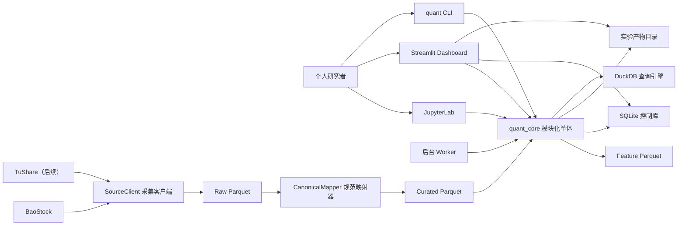
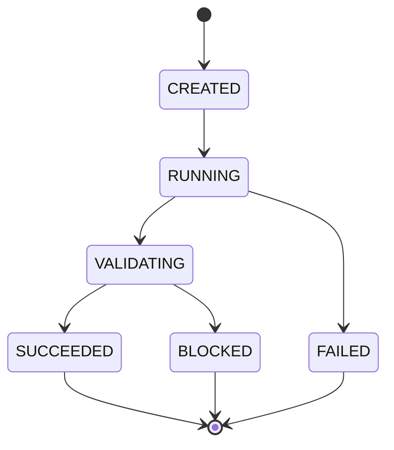
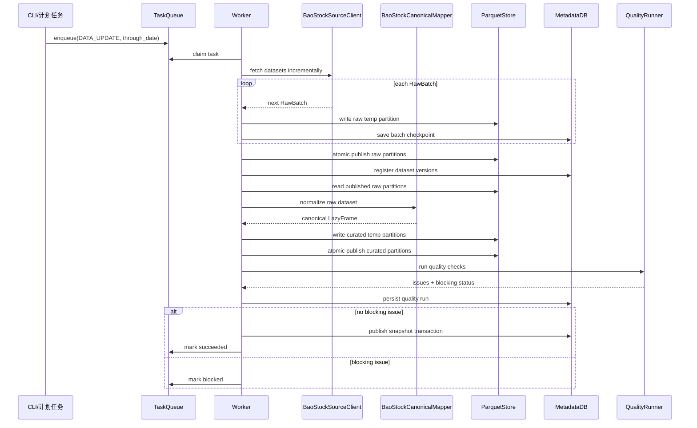
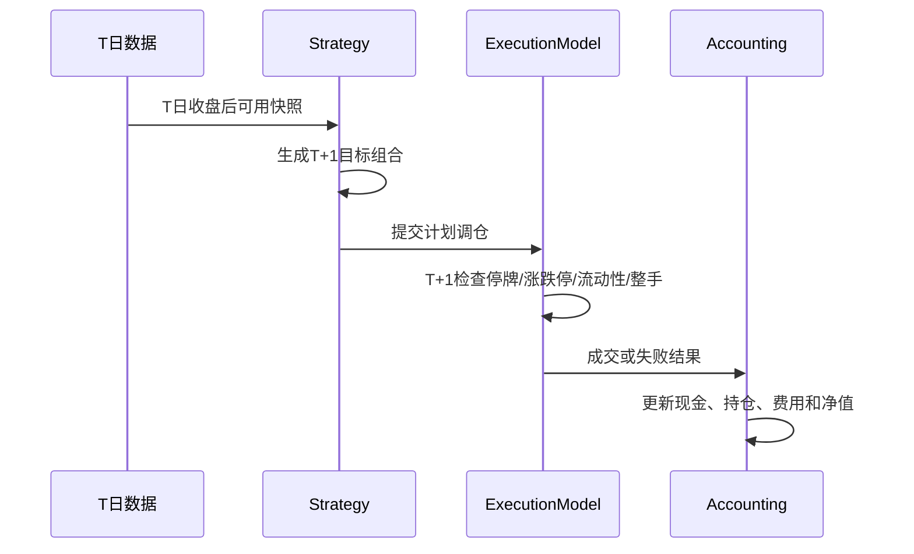
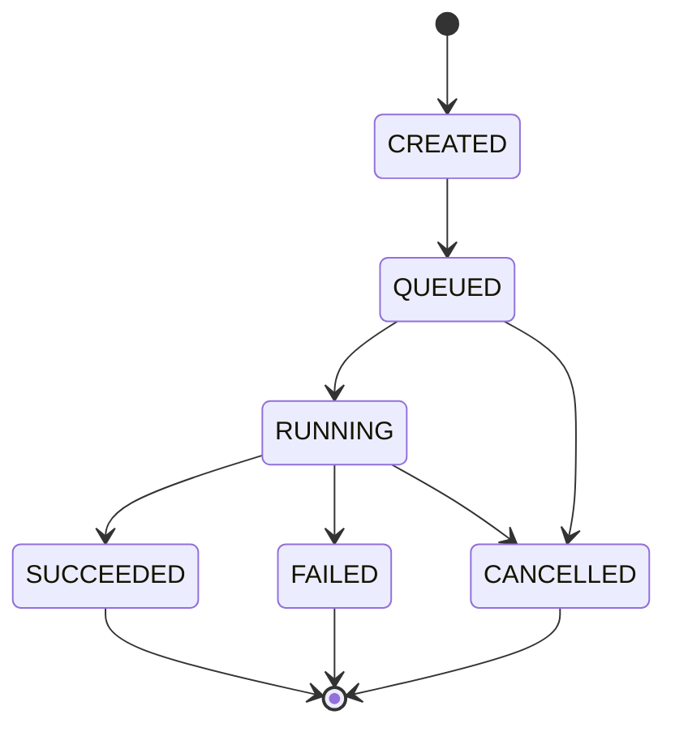

# 个人 A 股低频量化研究平台软件技术设计

文档状态：初稿，待技术审阅  
版本：1.0  
日期：2026-07-30  
关联需求：[个人 A 股低频量化研究平台需求规格](../superpowers/specs/2026-07-30-personal-a-share-quant-platform-design.md)  
目标读者：负责实现、测试和维护系统的程序工程师  

## 1. 设计目标

本文把需求规格转换为可实现的软件架构和接口设计。设计范围限于一期 MVP：20 年沪深 A 股日频数据、Notebook 策略实验室、ETF 轮动和股票多因子、可信日频回测、实验登记及本地 Dashboard。

一期不连接券商，不生成真实订单，不包含模拟盘、实盘风控和对账。技术边界需要支持后续扩展，但不提前实现后续阶段业务。

系统必须实现以下工程性质：

- 数据源可替换：一期 BaoStock，后续 TuShare。
- 时点正确：研究只能读取指定时刻已知的数据。
- 实验可复现：代码、配置、数据、环境和结果形成闭环。
- 回测可信：信号时点、成交时点和 A 股交易限制清晰分离。
- 本地可运维：Windows 单机运行，Dashboard 关闭不影响后台任务。
- 性能可验收：20 年全市场股票多因子完整回测不超过 60 分钟。

## 2. 架构决策摘要

| 决策 | 选择 | 理由 |
|---|---|---|
| 系统形态 | 模块化单体 | 个人单机部署，避免微服务运维成本 |
| 研究入口 | JupyterLab + Python SDK | 保留代码研究自由度，避免拖拽式编辑器 |
| 批处理入口 | Typer CLI | 便于脚本、任务计划程序和人工调用 |
| Dashboard | Streamlit + Plotly | 快速构建本地研究运营台 |
| 长任务 | 独立 Worker 进程 + SQLite 任务表 | 浏览器关闭不影响任务，不引入 Celery/Redis |
| 数据源边界 | SourceClient + Raw + CanonicalMapper | 先保存供应商原始语义，再执行规范化映射 |
| 分析数据 | Parquet + DuckDB | 列式存储、分区裁剪和本地向量分析 |
| 元数据 | SQLite + SQLAlchemy + Alembic | 事务、迁移、查询模型和未来 PostgreSQL 迁移 |
| 计算框架 | Polars 为主 | 控制内存和提升全市场计算性能 |
| 配置 | YAML + Pydantic v2 | 类型化、可版本化和可哈希 |
| 代码质量 | pytest、Ruff、mypy | 测试、静态检查和格式统一 |
| 包管理 | uv + `pyproject.toml` | 锁定依赖并记录环境 |

### 2.1 明确不采用

- 不采用 Kafka、Redis、Celery、Kubernetes 或微服务。
- 不在 Dashboard 进程中运行长回测。
- 不允许 Notebook 直接读写内部物理路径作为正式用法。
- 不为 BaoStock 和 TuShare 分别维护一套策略代码。
- 不使用逐证券逐日 Python 双重循环执行全市场因子计算。
- 不让 Streamlit 页面直接执行 SQL 更新核心元数据。

## 3. 系统上下文



## 4. 运行时组件

系统由四个本地进程入口组成，全部引用同一个 `quant_core` 包。

### 4.1 Notebook 进程

职责：交互式研究、策略定义、实验提交、轻量结果探索。

限制：

- 不直接修改 Raw、Curated、Feature 数据。
- 不自行实现第二套回测和指标逻辑。
- 长回测应通过 `ExperimentClient.submit()` 提交给 Worker。
- 临时探索允许返回内存 DataFrame，但正式结果必须登记为实验。

### 4.2 CLI 进程

建议命令：

```text
quant data bootstrap
quant data update --through 2026-07-30
quant data validate --snapshot 018fb069-0ca7-7c61-9407-f18be5cb6638
quant snapshot publish --as-of 2026-07-30
quant experiment run --config configs/experiments/examples/multifactor.yaml
quant worker start
quant dashboard start
quant doctor
```

CLI 是 Windows 任务计划程序和人工运维的稳定入口。

### 4.3 Worker 进程

职责：轮询任务表、领取任务、发送心跳、运行长任务、写入结果与最终状态。

一期只运行一个 Worker，避免 SQLite 多写入者争用。计算密集型任务内部可以使用 Polars 多线程，但同一时刻只执行一个顶层实验。

### 4.4 Dashboard 进程

职责：读取物化摘要、查询实验结果、提交受控任务、更新实验标签和结论。

Dashboard 通过应用服务访问数据，不直接拼接更新 SQL。耗时图表从实验摘要或预聚合 Parquet 读取，不触发完整回测。

## 5. 代码组织

```text
quant/                                      # 代码仓库根目录，只保存源码、配置、测试和文档
├─ pyproject.toml                           # 项目元数据、Python版本、依赖、工具和命令入口配置
├─ uv.lock                                  # uv生成的精确依赖锁，参与实验环境指纹计算
├─ README.md                                # 本地安装、启动、研究流程和常用命令说明
├─ .env.example                             # 环境变量示例，只列变量名，不包含真实凭据
├─ configs/                                 # 可版本化的运行与研究配置
│  ├─ base.yaml                             # 数据根目录、时区、日志等全局默认配置
│  ├─ data_sources/                         # 各供应商连接及采集策略配置
│  │  ├─ baostock.yaml                      # BaoStock超时、重试、批次和数据集开关
│  │  └─ tushare.yaml                       # TuShare正式适配时使用的连接与限流配置
│  ├─ rules/                                # 按版本维护的市场交易规则配置
│  │  └─ cn_equity.yaml                     # A股T+1、整手、涨跌幅和费用规则参数
│  ├─ strategies/                           # 可复用的策略默认参数
│  │  ├─ etf_rotation.yaml                  # ETF池、信号窗口、持有数量和调仓配置
│  │  └─ multifactor.yaml                   # 股票池、因子、权重、组合约束和调仓配置
│  └─ experiments/                          # 一次实验的完整可复现配置
│     └─ examples/                          # 快速开始及回归验证所用的示例实验配置
├─ src/quant_core/                          # 所有入口共享的正式Python核心包
│  ├─ __init__.py                           # 公共包版本及稳定顶层API导出
│  ├─ cli.py                                # Typer CLI命令定义和应用服务调用
│  ├─ settings.py                           # YAML、环境变量和路径的类型化加载与校验
│  ├─ errors.py                             # ErrorDetail、错误码和领域异常定义
│  ├─ logging.py                            # 结构化日志、上下文绑定和敏感字段过滤
│  ├─ domain/                               # 不依赖数据库、供应商或UI的纯领域模型
│  │  ├─ identifiers.py                     # InstrumentId、SnapshotId等稳定标识符
│  │  ├─ enums.py                           # 市场、板块、状态、严重级别等共享枚举
│  │  ├─ market.py                          # 行情、证券状态和公司行动领域对象
│  │  ├─ portfolio.py                       # 当前组合、目标持仓和权重领域对象
│  │  ├─ experiment.py                      # 实验状态、研究标记和产物描述对象
│  │  └─ task.py                            # 后台任务状态、进度和取消领域对象
│  ├─ data/                                 # 数据采集、Raw落盘、规范化、快照和查询边界
│  │  ├─ contracts.py                       # SourceClient、RawBatch、CanonicalMapper等协议
│  │  ├─ catalog.py                         # 数据集版本、分区和schema目录查询
│  │  ├─ repository.py                      # 面向研究层的时点化规范数据读取接口
│  │  ├─ snapshots.py                       # 快照manifest创建、校验、发布和解析
│  │  ├─ partitions.py                      # Parquet分区命名、哈希、临时写和原子发布
│  │  ├─ sources/                           # 只负责连接供应商并产生RawBatch的采集客户端
│  │  │  ├─ base.py                         # SourceClient公共协议、请求及能力模型
│  │  │  ├─ baostock.py                     # BaoStock认证、分页、重试和原始数据采集
│  │  │  └─ tushare_stub.py                 # 验证数据源可替换性的TuShare测试桩
│  │  ├─ mappers/                           # 从已发布Raw分区映射到统一Curated schema
│  │  │  ├─ base.py                         # CanonicalMapper协议、上下文和映射结果模型
│  │  │  ├─ baostock.py                     # BaoStock字段、代码、类型和单位规范化
│  │  │  └─ tushare_stub.py                 # 验证规范映射契约的TuShare测试映射器
│  │  ├─ pipelines/                         # 数据处理阶段的应用编排，不承载字段业务规则
│  │  │  ├─ ingest.py                       # SourceClient调用、Raw写入和采集清单登记
│  │  │  ├─ curate.py                       # Raw读取、CanonicalMapper调用和Curated写入
│  │  │  └─ publish.py                      # 质量门禁、快照manifest和事务化发布
│  │  └─ quality/                           # 数据质量模型、规则实现和批量执行
│  │     ├─ models.py                       # QualityRun、QualityIssue和检查结果模型
│  │     ├─ rules.py                        # 缺失、重复、时点、价格和覆盖率检查规则
│  │     └─ runner.py                       # 规则注册、运行、汇总及阻断级别判定
│  ├─ universe/                             # 历史时点股票池构建子系统
│  │  ├─ rules.py                           # 上市天数、板块、风险状态和流动性筛选规则
│  │  └─ builder.py                         # 按快照与日期生成股票池及剔除原因
│  ├─ factors/                              # 因子定义、依赖、缓存、处理和分析子系统
│  │  ├─ base.py                            # Factor协议、FactorContext和结果schema
│  │  ├─ registry.py                        # 因子ID/版本注册、查找和依赖DAG构建
│  │  ├─ cache.py                           # 因子内容哈希、缓存命中和Feature读写
│  │  ├─ transforms.py                      # 去极值、缺失处理、中性化和标准化
│  │  ├─ analysis.py                        # RankIC、分层收益、覆盖率和相关性计算
│  │  └─ builtin/                           # 一期随系统交付的基础因子实现
│  │     ├─ valuation.py                    # EP、BP等估值因子
│  │     ├─ quality.py                      # ROE、现金流质量等质量因子
│  │     ├─ momentum.py                     # 多窗口收益、趋势等动量因子
│  │     └─ risk.py                         # 波动率、下行波动等风险因子
│  ├─ strategies/                           # 将研究数据转为目标组合的策略实现
│  │  ├─ base.py                            # Strategy协议、上下文和提交前校验
│  │  ├─ etf_rotation.py                    # ETF排名、趋势过滤和目标权重策略
│  │  └─ multifactor.py                     # 多因子评分、选股和目标权重策略
│  ├─ portfolio/                            # 评分到可执行目标组合的构建逻辑
│  │  ├─ constructor.py                     # 按评分和约束生成TargetPortfolio
│  │  ├─ constraints.py                     # 个股、行业、换手、持仓数和流动性约束
│  │  └─ rebalance.py                       # 当前组合与目标组合差异及调仓数量计算
│  ├─ backtest/                             # 日频事件推进、成交模拟和组合会计
│  │  ├─ models.py                          # BacktestRequest、订单、成交和结果模型
│  │  ├─ engine.py                          # 日期级事件循环及各组件总编排
│  │  ├─ calendar.py                        # 信号日、成交日和下一交易日解析
│  │  ├─ rulebook.py                        # 按证券、板块和日期解析A股交易规则
│  │  ├─ execution.py                       # 停牌、涨跌停、滑点、容量及部分成交模型
│  │  ├─ accounting.py                      # 现金、持仓、T+1、费用、公司行动和净值记账
│  │  └─ artifacts.py                       # 回测明细流式写入标准实验产物
│  ├─ analytics/                            # 对标准回测产物进行独立分析和物化
│  │  ├─ performance.py                     # 收益、波动、Sharpe、回撤等绩效指标
│  │  ├─ factor_metrics.py                  # RankIC、分层收益及因子稳定性指标
│  │  ├─ attribution.py                     # 行业、风格、个股和期间收益归因
│  │  └─ materialize.py                     # 生成Dashboard使用的轻量摘要产物
│  ├─ experiments/                          # 实验生命周期、复现指纹和查询服务
│  │  ├─ models.py                          # 实验配置、状态及结果DTO
│  │  ├─ fingerprint.py                     # 配置、快照、源码、依赖和规则指纹计算
│  │  ├─ registry.py                        # 实验创建、状态转换、产物和指标登记
│  │  ├─ runner.py                          # 配置解析、策略构建、回测和分析流程编排
│  │  └─ query.py                           # Notebook与Dashboard共用的只读实验查询
│  ├─ tasks/                                # SQLite持久化后台任务队列与Worker运行时
│  │  ├─ models.py                          # TaskRun、尝试、心跳和进度模型
│  │  ├─ queue.py                           # 入队、领取、续租、取消和结束状态事务
│  │  ├─ worker.py                          # 单Worker轮询、心跳、执行和孤儿任务识别
│  │  └─ handlers.py                        # 数据更新、回测、报告等任务类型处理器
│  ├─ persistence/                          # SQLite持久化技术实现和仓储适配
│  │  ├─ database.py                        # SQLAlchemy引擎、会话和事务管理
│  │  ├─ orm.py                             # 数据集、快照、实验、任务和审计ORM模型
│  │  ├─ repositories.py                    # 领域仓储接口的SQLite实现
│  │  └─ migrations/                        # Alembic数据库schema版本迁移脚本
│  └─ dashboard/                            # Streamlit研究运营台及展示服务
│     ├─ app.py                             # 页面注册、全局布局、导航和应用启动
│     ├─ services.py                        # 页面使用的查询DTO及受控命令门面
│     ├─ components/                        # 可复用指标卡、表格、图表和状态组件
│     └─ pages/                             # 六个相互独立的Dashboard页面
│        ├─ overview.py                     # 系统、快照、实验和任务总览
│        ├─ data_center.py                  # 数据覆盖、版本、质量问题和更新任务
│        ├─ experiments.py                  # 实验筛选、比较、标记、复制和研究说明
│        ├─ backtest_analysis.py            # 净值、回撤、绩效、成交和归因分析
│        ├─ factor_analysis.py              # RankIC、分层收益、覆盖率和因子相关性
│        └─ tasks.py                        # 后台任务状态、日志、取消和安全重试
├─ notebooks/                               # 研究示例和交互式分析，不保存核心实现
│  ├─ 00_quickstart.ipynb                   # 环境检查、快照读取和实验提交快速入门
│  ├─ 10_etf_rotation.ipynb                 # ETF轮动基准实验及结果解释示例
│  └─ 20_multifactor.ipynb                  # 股票多因子、因子诊断和回测示例
└─ tests/                                   # 按风险类型而非源码目录机械镜像组织测试
   ├─ unit/                                 # 纯函数、领域规则和单组件快速测试
   ├─ point_in_time/                        # 未来函数、历史股票池和时点查询专项测试
   ├─ integration/                          # 适配器、管道、数据库、Worker和Dashboard集成测试
   ├─ regression/                           # 固定黄金数据与稳定输出回归测试
   ├─ performance/                          # 20年全市场回测及关键阶段性能测试
   └─ fixtures/                             # 共享小型市场数据、配置和预期结果夹具
```

可变数据、状态、实验产物和日志不属于代码仓库，统一放入第 25 节定义的 `QUANT_DATA_ROOT`。

目录依赖方向固定为：`domain ← data/factors/portfolio/backtest ← experiments/tasks/dashboard`。领域层不得依赖 Streamlit、BaoStock、DuckDB 或 SQLite。

## 6. 核心领域模型

### 6.1 标识符

内部证券标识采用稳定的 `InstrumentId`，不直接使用供应商代码作为主键。

```python
from dataclasses import dataclass
from enum import StrEnum


class Exchange(StrEnum):
    SSE = "SSE"
    SZSE = "SZSE"


@dataclass(frozen=True, slots=True)
class InstrumentId:
    exchange: Exchange
    symbol: str

    def canonical(self) -> str:
        return f"{self.exchange.value}:{self.symbol}"
```

示例：`SSE:600000`、`SZSE:000001`。适配器负责在内部标识与 `sh.600000` 等供应商代码之间转换。

### 6.2 关键枚举

```python
class Board(StrEnum):
    MAIN = "MAIN"
    CHINEXT = "CHINEXT"
    STAR = "STAR"


class ExperimentStatus(StrEnum):
    CREATED = "CREATED"
    QUEUED = "QUEUED"
    RUNNING = "RUNNING"
    SUCCEEDED = "SUCCEEDED"
    FAILED = "FAILED"
    CANCELLED = "CANCELLED"


class ResearchMark(StrEnum):
    UNREVIEWED = "UNREVIEWED"
    BASELINE = "BASELINE"
    CANDIDATE = "CANDIDATE"
    DISCARDED = "DISCARDED"


class Severity(StrEnum):
    INFO = "INFO"
    WARNING = "WARNING"
    SEVERE = "SEVERE"
    FATAL = "FATAL"
```

### 6.3 金额和价格

分析层行情使用 `Float64`，以获得列式计算性能。费用汇总和未来交易账本边界使用整数分或 `Decimal`，避免长期累计误差。回测输出同时保存原始浮点序列和按分取整后的费用明细。

### 6.4 时间标准

- 交易日使用 `datetime.date`。
- 时间戳使用带时区的 UTC 保存，界面转换为 `Asia/Shanghai`。
- 数据供应商仅提供日期时，`available_at` 按数据集策略推导并标记 `availability_source=INFERRED`。
- 财务数据缺少可信公告日或可用日时，不允许进入时点因子计算；不得以报告期末日期代替公告日。

## 7. 数据源抽象

### 7.1 能力模型

不同供应商能力不完全一致。采集客户端在启动时声明能力，管道据此决定可以采集哪些数据集；规范映射器只消费已经落盘的 Raw 数据。采集与映射之间以不可变 Raw 分区为边界，禁止边采集边直接生成 Curated 数据。

```python
@dataclass(frozen=True)
class ProviderCapabilities:
    daily_bars: bool
    trade_calendar: bool
    instruments: bool
    security_status: bool
    financials_with_announcement_date: bool
    corporate_actions: bool
    adjustment_factors: bool


@dataclass(frozen=True)
class RawBatch:
    provider: str
    dataset: str
    request: Mapping[str, JsonValue]
    retrieved_at: datetime
    frame: pl.DataFrame


class SourceClient(Protocol):
    @property
    def name(self) -> str: ...

    def capabilities(self) -> ProviderCapabilities: ...
    def login(self) -> None: ...
    def close(self) -> None: ...
    def fetch_trade_calendar(self, start: date, end: date) -> RawBatch: ...
    def fetch_instruments(self, as_of: date) -> RawBatch: ...
    def fetch_daily_bars(
        self,
        start: date,
        end: date,
        instruments: Sequence[InstrumentId] | None = None,
    ) -> Iterable[RawBatch]: ...
    def fetch_security_status(self, start: date, end: date) -> RawBatch: ...
    def fetch_financials(self, start: date, end: date) -> RawBatch: ...
    def fetch_corporate_actions(self, start: date, end: date) -> RawBatch: ...


class CanonicalMapper(Protocol):
    @property
    def provider(self) -> str: ...

    def normalize(
        self,
        dataset: str,
        raw: pl.LazyFrame,
        context: Mapping[str, JsonValue],
    ) -> pl.LazyFrame: ...
```

若 BaoStock 缺少某项满足质量要求的数据，采集客户端必须返回“不具备能力”，而不是构造看似完整的数据。依赖该能力的因子或回测模式应在提交实验时被拒绝，并返回明确错误。

#### `fetch_daily_bars` 的证券范围语义

`instruments` 使用以下固定语义：

- `None`：采集请求日期区间内的全部证券。
- 空序列，例如 `[]` 或 `()`：与 `None` 相同，采集全部证券。
- 非空序列：只采集指定的内部证券标识。

“全部证券”定义为：证券上市区间与 `[start, end]` 存在交集，并且交易所、证券类型和板块属于当前数据源配置允许范围的全部历史证券。它不能只使用请求结束日仍然上市的证券，否则会产生幸存者偏差。

BaoStock 日线采用固定的混合路由语义，详见 [BaoStock 全市场日线混合路由设计](../superpowers/specs/2026-07-31-baostock-daily-market-route-design.md)：

- `None` 或空序列：先解析交易日历，再按每个开市日调用 `query_daily_history_k_AStock`；每个开市日生成一个 `RawBatch`，休市日不调用日线 API。
- 非空序列：按证券块和日期块调用 `query_history_k_data_plus`，只采集指定的内部证券标识。

全市场模式必须先解析并冻结请求窗口内的完整历史 A 股目录；每个 `RawBatch.request` 记录 `scope="ALL"`、开市日期、目录证券数量及其排序后 SHA-256、当日响应证券数量及其排序后 SHA-256。空序列触发全市场模式时必须写入结构化信息日志，使意外传入空筛选条件可以被审计。`max_instruments_per_batch` 与 `max_days_per_batch` 分块配置只作用于非空证券列表的定向路径，不影响按开市日调用的全市场路径。

方法返回 `Iterable[RawBatch]`，调用方逐批写入 Raw 临时分区并登记检查点，不得把全部证券的 20 年行情合并为一个内存 `DataFrame`。Raw 仍先于映射落地，Mapper 保持后置，公共流程不变：

```text
BaoStock -> Raw Parquet -> CanonicalMapper -> Curated Parquet -> Snapshot
```

调用示例：

```python
# 全量：None和空序列语义相同
all_batches = client.fetch_daily_bars(start, end, instruments=None)
all_batches_from_empty = client.fetch_daily_bars(start, end, instruments=[])

# 指定证券
selected_batches = client.fetch_daily_bars(
    start,
    end,
    instruments=[InstrumentId(Exchange.SSE, "600000")],
)
```

### 7.2 采集与映射原则

- SourceClient 只负责认证、分页、重试和取得供应商结果。
- SourceClient 分批返回的每个 `RawBatch.frame` 保留供应商字段名、值语义和字符串表示，并首先保存到 Raw 层。
- Raw Parquet 同时保存请求参数、供应商错误码、页码、返回行数、查询时间和 schema 清单。
- Raw 是“供应商语义不可变”，不是供应商网络响应字节的逐字节归档；BaoStock SDK 不提供原始 HTTP 响应时，以 SDK 返回表格和请求清单为原始事实。
- CanonicalMapper 只读取已发布 Raw 分区，将供应商字段映射为规范领域模型。
- 类型转换、证券代码转换、日期解析、单位换算和业务修正规则全部发生在 Raw 之后，并产生质量记录。
- CanonicalMapper 不访问网络，不写 Raw，不引用策略或回测模块。
- BaoStock 与 TuShare 分别实现 SourceClient 和 CanonicalMapper，但输出相同 Curated schema，上层不感知供应商切换。

## 8. 规范数据模型

### 8.1 `instrument`

| 字段 | 类型 | 说明 |
|---|---|---|
| instrument_id | Utf8 | `SSE:600000` |
| vendor_code | Utf8 | 当前来源代码 |
| name | Utf8 | 证券简称 |
| exchange | Enum | SSE/SZSE |
| board | Enum | MAIN/CHINEXT/STAR |
| instrument_type | Enum | STOCK/ETF/INDEX |
| list_date | Date | 上市日 |
| delist_date | Date? | 退市日 |
| source | Utf8 | 数据来源 |
| source_version | Utf8 | 来源版本 |
| available_at | Datetime[UTC] | 系统可用时刻 |

### 8.2 `daily_bar`

主键：`instrument_id + trade_date + source_version`。

| 字段 | 类型 |
|---|---|
| instrument_id | Utf8 |
| trade_date | Date |
| open/high/low/close | Float64 |
| volume | Int64 |
| amount | Float64 |
| prev_close | Float64? |
| turnover_rate | Float64? |
| adjustment_factor | Float64? |
| suspended | Boolean |
| source/source_version | Utf8 |
| available_at/ingested_at | Datetime[UTC] |

交易模拟使用未复权 OHLC；策略不得自行拼接复权因子。

#### 研究价格口径

ETF 与股票的市场行情因子在 MVP 统一使用 BaoStock 原始 `close/preclose`
逐行推导的 `baostock_forward_log_return_v2`：当 `close` 与 `preclose` 均为正数时，
`r(t)=log(close(t))-log(preclose(t))`，其公式标识为
`log_close_minus_log_preclose_v2`。该写法与 `log(close(t)/preclose(t))` 数学等价，
但不构造中间比值，可避免极端价格尺度下比值先发生上溢或下溢。对每只证券，
查询结果首行的 `preclose` 为 null 或正负零时，仅该行 `forward_log_return` 输出
类型确定的 null；首行 `preclose` 为有限正数时仍按上述公式计算。除此之外，价格
服务采用 fail closed：任意 `close` 为空、非正或非有限，首行 `preclose` 为负数或
非有限，后续 `preclose` 为空、正负零、负数或非有限，以及非空 `open/high/low`
为非正或非有限时，均拒绝整次请求；复权因子、累计收益指数、非空逐行对数收益
或调整后价格出现非法值时同样在服务级拒绝，不会逐字段降级为 null。每个因子
窗口把首行对数价格设为 0，忽略首行自身的 `r`，并按固定
顺序累加后续逐行收益形成相对对数价格路径。逐行收益不依赖请求起点或累计
指数，因此跨请求起点、追加未来跳变时，既有信号行的数值和内容哈希保持字节
稳定。`baostock_return_index_v1` 仍可用于展示与其他研究场景，但市场因子不再
消费该累计指数。同一涨跌幅链条生成的前复权价格只调整
`open/high/low/close/preclose`；`volume` 与 `amount` 保持供应商原始值。

`BACKWARD` 保留为兼容接口，不是 MVP 市场因子的默认研究口径。公司行动
数据仍是现金精确会计与财务能力门禁的后续生产要求；它不再是 BaoStock
市场因子生成前复权价格的前置数据集。

### 8.3 `security_status`

主键：`instrument_id + trade_date + source_version`。

字段包括 `is_listed`、`is_suspended`、`is_risk_warning`、`board`、`price_limit_rule_id` 和 `tradable_reason`。

### 8.4 `financial_observation`

| 字段 | 类型 | 说明 |
|---|---|---|
| instrument_id | Utf8 | 证券 |
| report_period | Date | 报告期 |
| metric | Utf8 | 规范指标名 |
| value | Float64 | 指标值 |
| announced_at | Datetime[UTC] | 公告时间 |
| available_at | Datetime[UTC] | 系统可用时间 |
| revision | Int32 | 修订序号 |
| source/source_version | Utf8 | 来源信息 |

时点查询按 `available_at <= as_of` 过滤，再对 `instrument_id + report_period + metric` 选择最新可用修订。

### 8.5 `corporate_action`

字段包括 `action_type`、`record_date`、`ex_date`、`pay_date`、`cash_per_share`、`share_ratio`、`rights_price`、`available_at` 和来源版本。

如果实验要求现金精确记账，而数据快照缺少影响区间内的公司行动能力，实验校验失败。允许另设“复权收益模式”用于快速因子研究，但报告必须明确会计模式，不能与现金精确模式混淆。

### 8.6 `factor_value`

主键：`factor_id + factor_version + instrument_id + trade_date + snapshot_id`。

字段包括原始值、处理后值、缺失原因、覆盖状态和输入指纹。

## 9. 物理存储设计

### 9.1 Parquet 布局

```text
data/raw/provider=baostock/dataset=daily_bar/ingest_date=2026-07-30/run_id={run_id}/*.parquet
data/curated/dataset=daily_bar/year=2026/*.parquet
data/curated/dataset=financial_observation/report_year=2025/*.parquet
data/features/factor_id=momentum_120d/version=1/year=2026/*.parquet
data/snapshots/snapshot_id={snapshot_id}/manifest.json
artifacts/experiments/experiment_id={experiment_id}/...
```

日行情按年分区，不按证券生成大量小文件。每个分区目标压缩后约 128–512 MB；写入时合并小文件。默认使用 Zstandard 压缩。

### 9.2 快照实现

快照不复制 20 年全量数据。`manifest.json` 保存逻辑引用：

```json
{
  "snapshot_id": "uuid",
  "as_of": "2026-07-30T16:30:00+08:00",
  "status": "PUBLISHED",
  "datasets": {
    "daily_bar": ["content-hash-1", "content-hash-2"],
    "instrument": ["content-hash-3"],
    "financial_observation": ["content-hash-4"]
  },
  "quality_run_id": "uuid"
}
```

分区写完后计算内容哈希并登记。发布快照只新增 manifest 和元数据记录，不改变历史分区。

### 9.3 DuckDB 使用方式

- `quant.duckdb` 只保存视图、宏和可重建的物化摘要。
- 事实数据以 Parquet 为事实源。
- 连接按进程创建，不跨进程共享 Python 连接对象。
- 写入 Parquet 使用临时文件加原子重命名，避免暴露半成品。

## 10. SQLite 控制库

控制库只保存元数据和小型摘要，不保存完整行情和逐日持仓明细。

### 10.1 核心表

#### `dataset_version`

保存数据集、分区、来源、内容哈希、行数、时间范围、创建批次和状态。

#### `snapshot`

保存快照 ID、`as_of`、状态、manifest 路径、质量运行 ID、创建时间和发布时间。

#### `quality_run` / `quality_issue`

保存检查批次和每条质量问题的规则 ID、严重级别、数据集、范围、实际值、阈值和处理状态。

#### `experiment`

保存实验 ID、名称、策略类型、状态、研究标记、配置 JSON、指纹、快照 ID、Git 版本、环境指纹、时间和错误摘要。

#### `experiment_metric`

保存实验级标量指标：指标名、数值、周期和计算版本。

#### `experiment_artifact`

保存产物类型、相对路径、内容哈希、行数和大小。

#### `experiment_note` / `experiment_tag`

保存研究结论和标签。完成实验的核心字段不可更新；研究标记、标签和追加式说明允许变更并保留审计记录。

#### `task_run`

保存任务类型、状态、参数、优先级、尝试次数、锁、心跳、进度、日志路径、错误码和时间。

#### `audit_event`

保存 Dashboard 或 CLI 发起的状态变更：主体、动作、对象、旧值摘要、新值摘要、请求 ID 和时间。

### 10.2 事务边界

- 任务领取：比较并更新 `QUEUED → RUNNING`，单事务完成。
- 实验成功：验证全部必需产物后，在单事务中登记指标、产物并更新 `RUNNING → SUCCEEDED`。
- 快照发布：确认无阻断质量问题后，在单事务中更新 `DRAFT → PUBLISHED`。
- 文件先写临时路径，校验成功后原子移动，再提交数据库引用。

## 11. 配置系统

配置分为基础配置、数据源配置、规则配置、策略配置和实验配置。

```yaml
experiment:
  name: multifactor_baseline
  strategy: multifactor
  snapshot_id: "018fb069-0ca7-7c61-9407-f18be5cb6638"
  start_date: 2006-07-31
  end_date: 2026-07-30
  benchmark: SSE:000300
  initial_cash: 1000000

rebalance:
  frequency: weekly
  signal_at: close
  execute_at: next_open

portfolio:
  holdings: 40
  max_stock_weight: 0.04
  max_industry_weight: 0.15
  max_turnover: 0.20

execution:
  accounting_mode: cash_exact
  max_volume_participation: 0.02
  slippage_bps: 10
  lot_size: 100
```

配置加载后由 Pydantic 生成不可变模型。序列化时按字段排序和规范浮点格式生成配置哈希。环境变量只覆盖凭据和本机路径，不覆盖策略语义参数。

## 12. 数据管道

### 12.1 管道状态



### 12.2 数据更新序列



### 12.3 增量策略

- 交易日历：每次向未来额外请求一个缓冲区并合并。
- 证券主数据：每日获取快照，转为有效期模型。
- 日行情：从本地最新完整交易日的下一交易日开始请求。
- 财务数据：回看最近若干报告期以捕获修订，但写为新来源版本。
- 公司行动：回看可配置窗口，检测新增与修订。
- 失败重试以相同 `run_id` 续跑未发布分区；已发布内容哈希相同时不重复登记。

## 13. 股票池与时点查询

### 13.1 查询接口

```python
class ResearchDataRepository(Protocol):
    def bars(
        self,
        snapshot_id: UUID,
        instruments: Sequence[InstrumentId] | None,
        start: date,
        end: date,
        adjustment: PriceAdjustment,
    ) -> pl.LazyFrame: ...

    def financials_as_of(
        self,
        snapshot_id: UUID,
        as_of: datetime,
        metrics: Sequence[str],
    ) -> pl.LazyFrame: ...

    def security_status(
        self, snapshot_id: UUID, start: date, end: date
    ) -> pl.LazyFrame: ...
```

必须显式传入 `snapshot_id`。不提供“自动取最新数据”的底层研究 API，避免实验在重跑时漂移。

### 13.2 股票池规则

```python
@dataclass(frozen=True)
class UniverseRules:
    boards: frozenset[Board]
    min_listed_trading_days: int
    exclude_risk_warning: bool
    exclude_suspended: bool
    min_avg_amount_window: int
    min_avg_amount: float


class UniverseBuilder:
    def build(
        self,
        snapshot_id: UUID,
        dates: Sequence[date],
        rules: UniverseRules,
    ) -> pl.DataFrame: ...
```

输出采用 `trade_date + instrument_id + eligible + exclusion_reason`，所有剔除原因可解释并写入实验产物。

## 14. 因子系统

### 14.1 因子接口

```python
class Factor(Protocol):
    factor_id: str
    version: str
    dependencies: tuple[str, ...]
    lookback_trading_days: int

    def compute(self, ctx: "FactorContext") -> pl.LazyFrame: ...


@dataclass(frozen=True)
class FactorContext:
    snapshot_id: UUID
    start: date
    end: date
    repository: ResearchDataRepository
    parameters: Mapping[str, JsonValue]
```

`FactorRegistry` 要求 `factor_id + version` 唯一。内置因子和用户因子使用同一接口。

### 14.2 因子依赖与缓存

缓存键：

```text
SHA256(
  factor_id + factor_version + normalized_parameters
  + snapshot_id + input_dataset_hashes + date_range
)
```

因子 DAG 先拓扑排序，再计算未命中的节点。缓存命中时直接读取 Feature Parquet。因子定义变化必须提升版本或改变代码指纹，不能沿用旧缓存。

### 14.3 横截面处理

处理顺序固定并记录参数：

```text
原始因子
→ 按股票池过滤
→ 缺失值标记/处理
→ 去极值
→ 行业/市值中性化
→ 标准化
→ 方向统一
→ 合成评分
```

每一步输出覆盖率、分布摘要和异常数量。中性化采用每个交易日横截面回归，禁止把未来日期样本加入当日拟合。

### 14.4 MVP 因子范围

MVP 因子用于验证行情因子、时点财务因子、横截面处理、缓存、组合构建和 Dashboard 分析的完整链路。范围控制为：ETF 5 个行情因子、股票 8 个 Alpha 因子，以及 3 个不参与 Alpha 合成的辅助字段。

#### ETF 轮动因子

| 因子 ID | 定义 | 方向 | 最小历史窗口 | 用途 |
|---|---|---|---:|---|
| `return_20d_v1` | `expm1(sum(r[1:21]))` | 越高越好 | 20日 | 短期动量 |
| `return_60d_v1` | `expm1(sum(r[1:61]))` | 越高越好 | 60日 | 中期动量 |
| `return_120d_v1` | `expm1(sum(r[1:121]))` | 越高越好 | 120日 | 长期动量 |
| `trend_120d_v1` | `OLS斜率([0, cumsum(r[1:120])], x=0..119)` | 越高越好 | 120日 | 趋势过滤 |
| `volatility_60d_v1` | `std(r[1:61], ddof=1) × sqrt(252)` | 越低越好 | 61日 | 波动率惩罚 |

`r` 是统一价格服务输出的 `forward_log_return`。窗口首行的 `r` 属于窗口前一日到首日的收益，必须忽略；后续 null 或非有限值使该信号失效。ETF 基线策略使用三个收益因子形成动量分数，以 `trend_120d_v1 > 0` 作为趋势过滤，并对 `volatility_60d_v1` 施加惩罚。具体权重属于策略配置，不写入因子实现。

#### 股票 Alpha 因子

| 类别 | 因子 ID | 定义 | 方向 | 数据依赖 |
|---|---|---|---|---|
| 估值 | `earnings_yield_ttm_v1` | 当 `peTTM > 0` 时取 `1 / peTTM`，否则为 `null` | 越高越好 | 日频估值字段 |
| 估值 | `book_to_price_mrq_v1` | 当 `pbMRQ > 0` 时取 `1 / pbMRQ`，否则为 `null` | 越高越好 | 日频估值字段 |
| 质量 | `roe_avg_pit_v1` | `available_at <= signal_at` 的最新报告平均 ROE | 越高越好 | 时点财务数据 |
| 质量 | `cfo_to_np_pit_v1` | 最新可用报告的经营现金流/净利润 | 越高越好 | 时点现金流数据 |
| 动量 | `momentum_120_20_v1` | `expm1(sum(r[1:101]))` | 越高越好 | `baostock_forward_log_return_v2` |
| 风险 | `volatility_60d_v1` | 60 日逐行对数收益标准差年化 | 越低越好 | `baostock_forward_log_return_v2` |
| 风险 | `downside_volatility_60d_v1` | `sqrt(mean(min(r[1:61], 0)^2)) × sqrt(252)` | 越低越好 | `baostock_forward_log_return_v2` |
| 风险 | `max_drawdown_120d_v1` | 相对对数价格路径的 120 日最大回撤 | 越低越好 | `baostock_forward_log_return_v2` |

估值因子不得将负 PE、零 PB 或缺失值转换成正常分数。`cfo_to_np_pit_v1` 在净利润绝对值低于配置阈值时输出 `null`，防止分母接近零产生无意义极值。财务因子必须通过 `financials_as_of()` 查询；缺少可靠公告时间的数据不得使用报告期末日期替代。

#### 辅助字段

| 字段 ID | 定义 | 用途 | 是否进入 Alpha 得分 |
|---|---|---|---|
| `avg_amount_20d_v1` | 过去 20 个交易日日均成交额 | 股票池流动性过滤、容量分析 | 否 |
| `log_market_cap_v1` | `log(unadjusted_close × total_shares)` | 市值中性化和风格暴露 | 否 |
| `industry_code_pit_v1` | 历史时点有效的行业分类 | 行业中性化、约束和归因 | 否 |

如果可靠流通股本可用，可以另外输出流通市值，但不得通过成交量和换手率反推后当作精确股本。行业分类必须带有效期，当前行业分类不能覆盖历史。

### 14.5 因子方向和处理规则

每个因子必须声明 `HIGHER_IS_BETTER` 或 `LOWER_IS_BETTER`。横截面处理完成后，系统将低值优先因子乘以 `-1`，保证进入合成阶段的标准化分数统一为“越高越好”。原始因子值保持原始方向，方便审计和解释。

股票 Alpha 的处理规则为：

```text
按当日股票池过滤
→ 保留原始缺失原因
→ MAD 去极值
→ 行业和 log_market_cap 中性化
→ 横截面标准化
→ 统一方向
→ 类别内平均
→ 类别加权合成
```

MVP 基线类别权重为配置默认值：估值 25%、质量 25%、动量 30%、风险 20%。因子模块不持有这些权重；权重由 `multifactor.yaml` 和实验配置传入。

### 14.6 缺失值与可用性

- 原始缺失、无效分母、历史窗口不足和数据能力不足使用不同 `missing_reason`。
- 财务缺失不得填零，也不得使用未来报告填充。
- MVP 不对原始 Alpha 因子做跨日期填补。
- 股票至少需要 8 个 Alpha 因子中的 6 个有效值。
- 估值、质量、动量和风险四类中，每类至少有一个有效因子。
- 类别内存在一个有效因子时，可以用该因子形成类别分数；实验报告必须披露有效因子数量。
- 不满足最小覆盖条件的证券不进入最终排名，并记录 `INSUFFICIENT_FACTOR_COVERAGE`。

### 14.7 因子注册示例

```python
FactorSpec(
    factor_id="momentum_120_20",
    version="1",
    entity_types=frozenset({InstrumentType.STOCK}),
    dependencies=("adjusted_close",),
    lookback_trading_days=120,
    direction=FactorDirection.HIGHER_IS_BETTER,
    frequency="daily",
    null_policy=NullPolicy.KEEP_NULL,
)
```

`factor_id + version` 构成逻辑版本。公式、时点口径、缺失规则或输出语义发生变化时必须提升版本，不能覆盖旧 Feature 缓存。

### 14.8 数据源注意事项

BaoStock 日线和财务接口的字段及历史覆盖在实现时以其[官方 Python API 文档](https://www.baostock.com/mainContent?file=pythonAPI.md)为准。前复权价格和累计收益指数供展示与其他研究使用；市场信号统一消费逐行 `forward_log_return`。BaoStock 的涨跌幅复权算法不等价于现金分红精确会计，具体限制见其[复权因子说明](https://www.baostock.com/helpdocs/pdf/BaoStock%E5%A4%8D%E6%9D%83%E5%9B%A0%E5%AD%90%E7%AE%80%E4%BB%8B.pdf)。

当 SourceClient 声明缺少 `financials_with_announcement_date` 能力时，`roe_avg_pit_v1` 和 `cfo_to_np_pit_v1` 必须标记为不可用，股票多因子基线实验在提交阶段失败，不能退化为非时点财务数据。

### 14.9 MVP 暂缓因子

一期不实现以下因子：

- 营收、利润和每股收益增长因子。
- 应计利润及复杂财务报表重构因子。
- 分析师一致预期、评级和目标价因子。
- 新闻、公告文本和情绪因子。
- 北向资金、龙虎榜和资金流因子。
- 分钟、Tick 和盘口因子。
- 机器学习预测因子和自动因子挖掘。
- Barra 式完整风险模型。
- 大量同质技术指标组合。

扩展新因子必须提供数据时点定义、公式、方向、缺失策略、最小窗口、单元测试和因子版本，不因“数据可取”而自动加入 MVP。

## 15. 策略和组合接口

### 15.1 策略接口

```python
class Strategy(Protocol):
    strategy_id: str
    version: str

    def validate(self, ctx: "StrategyContext") -> list[ValidationIssue]: ...

    def generate_targets(
        self,
        ctx: "StrategyContext",
        rebalance_date: date,
        current: "PortfolioState",
    ) -> "TargetPortfolio": ...
```

策略只产生目标组合，不决定实际成交。ETF 轮动和多因子策略共享 `TargetPortfolio` 输出。

### 15.2 目标组合

```python
@dataclass(frozen=True)
class TargetPosition:
    instrument_id: InstrumentId
    target_weight: float
    score: float | None
    reason_code: str


@dataclass(frozen=True)
class TargetPortfolio:
    signal_date: date
    execute_date: date
    positions: tuple[TargetPosition, ...]
    cash_weight: float
```

构造器依次执行个股、行业、持仓数、换手和流动性约束。无法满足全部约束时返回结构化 `ConstraintViolation`，不得静默放宽规则。

## 16. 回测引擎设计

### 16.1 混合向量化架构

回测采用“日期级事件循环 + 当日横截面向量计算”：

- 外层只按交易日推进。
- 股票池、因子、估值和可交易掩码使用 Polars/DuckDB 批量计算。
- 每个调仓日一次性生成全横截面目标组合。
- 成交和账户记账按订单集合向量处理。
- 不使用每只证券逐日 Python 对象事件循环。

该结构保留 A 股交易时序，同时满足全市场性能目标。

### 16.2 时间线



`signal_date` 与 `execute_date` 是不同字段。规则测试必须证明使用 T 日收盘数据时不能按 T 日收盘价成交。

### 16.3 回测接口

```python
@dataclass(frozen=True)
class BacktestRequest:
    experiment_id: UUID
    snapshot_id: UUID
    strategy: Strategy
    start_date: date
    end_date: date
    benchmark: InstrumentId
    initial_cash_fen: int
    rulebook_version: str
    execution_config: ExecutionConfig


class BacktestEngine:
    def run(
        self,
        request: BacktestRequest,
        progress: ProgressSink,
        cancellation: CancellationToken,
    ) -> BacktestResult: ...
```

### 16.4 RuleBook

交易规则通过版本化配置加载：

```python
class MarketRuleBook(Protocol):
    def lot_size(self, instrument: InstrumentId, trade_date: date) -> int: ...
    def earliest_sell_date(self, buy_date: date, instrument: InstrumentId) -> date: ...
    def price_limits(
        self, instrument: InstrumentId, trade_date: date, prev_close: float
    ) -> PriceBand | None: ...
    def fees(self, fill: SimulatedFill) -> FeeBreakdown: ...
```

规则选择依据证券、板块、风险状态和日期。规则版本写入实验元数据，历史实验不跟随新规则配置变化。

### 16.5 成交模型

订单生成采用目标权重与当前权重之差。成交模型执行：

1. 检查交易日和证券状态。
2. 检查停牌。
3. 检查买卖方向对应的涨跌停不可成交条件。
4. 计算参考价格和滑点。
5. 应用成交量参与率。
6. 应用整手规则和资金约束。
7. 生成完全成交、部分成交或拒绝结果。

每笔模拟结果包含 `reason_code`，例如 `SUSPENDED`、`LIMIT_UP_BUY_BLOCKED`、`LIMIT_DOWN_SELL_BLOCKED`、`INSUFFICIENT_CASH`、`VOLUME_CAP`。

### 16.6 会计模型

账户状态至少包含：

- 可用现金。
- 证券总数量。
- 当日可卖数量。
- 成本基础。
- 应计费用。
- 已实现和未实现损益。
- 组合净值。

公司行动在除权除息日期进入事件序列。现金精确模式调整现金和持股数量；复权收益模式仅用于快速研究并在报告顶部显著标识。

## 17. 实验系统

### 17.1 实验指纹

实验指纹由以下内容规范化后计算 SHA-256：

- 策略 ID 和版本。
- 完整实验配置。
- 数据快照 ID 及其 manifest 哈希。
- Git 提交或源码树哈希。
- 依赖锁文件哈希。
- RuleBook 版本。

实验 ID 每次提交均新建；相同指纹用于发现重复实验和复现比较，不用于复用同一个实验记录。

### 17.2 状态机



完成态不可回退。重试创建新的 `task_run` 尝试记录，但沿用实验 ID；若实验已成功，则不能重跑覆盖，必须复制配置创建新实验。

### 17.3 产物契约

```text
artifacts/experiments/experiment_id={experiment_id}/
├─ manifest.json
├─ resolved_config.yaml
├─ environment.json
├─ metrics.json
├─ nav.parquet
├─ drawdown.parquet
├─ holdings.parquet
├─ targets.parquet
├─ fills.parquet
├─ costs.parquet
├─ factor_metrics.parquet
├─ attribution.parquet
├─ quality_disclosure.json
├─ report.html
└─ run.log
```

实验成功前验证必需文件存在、模式正确、哈希可计算。SQLite 只保存索引和标量指标。

### 17.4 Notebook SDK

```python
from quant_core.experiments import ExperimentClient

client = ExperimentClient.from_default_settings()
experiment = client.create_from_yaml("configs/experiments/examples/multifactor.yaml")
task = client.submit(experiment.id)
client.wait(task.id, poll_seconds=2)
result = client.result(experiment.id)
result.metrics()
result.nav()
```

`wait()` 只是 Notebook 的便利函数；关闭 Notebook 不会停止 Worker 中的任务。

## 18. 任务队列和 Worker

### 18.1 任务领取

Worker 每 2 秒轮询一次 `QUEUED` 任务，在 SQLite `BEGIN IMMEDIATE` 事务中领取最早且优先级最高的任务。领取时写入 `worker_id`、`locked_at` 和 `heartbeat_at`。

### 18.2 心跳和失联

- Worker 每 10 秒更新心跳。
- 心跳超过 60 秒未更新的运行任务标记为 `ORPHANED`。
- `ORPHANED` 不自动重跑；用户在任务页确认后创建新尝试。
- 支持协作式取消：Worker 在日期批次边界检查取消令牌。

### 18.3 进度

进度按阶段和完成比例保存，例如：

```json
{
  "stage": "FACTOR_COMPUTE",
  "completed": 1280,
  "total": 5000,
  "message": "momentum_120d"
}
```

Dashboard 每 2–5 秒刷新运行任务，不读取运行进程内存。

## 19. 分析与报告

### 19.1 指标计算

指标模块只依赖标准回测产物，不依赖策略实现。指标定义和年化口径有独立版本号。

至少计算：

- 累计和年化收益。
- 年化波动率。
- Sharpe、Sortino、Calmar。
- 最大回撤、起止日期和恢复日期。
- 月度、年度和滚动收益。
- 换手率、费用率、滑点和成交失败率。
- 相对基准收益和信息比率。

### 19.2 因子分析

按交易日横截面计算 RankIC；分层收益明确分组数量、缺失处理、加权口径和下一期收益区间。年度聚合从日级产物计算，不直接读取 Notebook 临时变量。

### 19.3 物化摘要

实验完成后生成 Dashboard 直接消费的摘要：

- `metrics.json`：卡片指标。
- `nav.parquet`：净值和回撤图。
- `monthly_returns.parquet`：月度热力图。
- `exposure_summary.parquet`：行业和风格暴露。
- `factor_summary.parquet`：因子分析摘要。

Dashboard 常规页面不扫描全量 `holdings.parquet`，只有用户下钻时才按日期分区查询。

## 20. Dashboard 技术设计

### 20.1 分层

```text
Streamlit Page
→ DashboardService
→ ExperimentQuery / TaskCommand / DataCatalogQuery
→ SQLite + DuckDB + 实验摘要产物
```

页面不直接创建数据库会话，不直接定位 Parquet 物理路径。`DashboardService` 返回面向展示的 DTO。

### 20.2 页面职责

#### 系统总览

读取最新发布快照、最近质量运行、实验统计、任务统计和两套基准策略摘要。任何未知状态显示为灰色或警告，不显示为正常。

#### 数据中心

展示数据集覆盖、版本、质量问题和数据任务。重试按钮只调用 `TaskCommand.retry(task_id)`，服务端校验任务是否幂等、是否已结束及是否存在活动尝试。

#### 实验中心

支持筛选、比较、复制配置、追加标签和研究结论。完成实验的配置、快照、指标和产物不可编辑。

#### 回测分析

从物化摘要绘制净值、回撤、月度收益和指标；持仓与成交下钻通过 DuckDB 对单个实验产物查询。

#### 因子分析

读取因子摘要和按需明细，提供 RankIC、分层收益、覆盖率、相关性和中性化对比。

#### 任务与日志

显示状态、进度、资源摘要和结构化错误。日志只读取当前任务日志文件，并限制最大返回行数。

### 20.3 缓存

- Streamlit 资源缓存用于只读服务对象和 schema。
- 数据缓存键必须包含实验 ID、产物哈希和查询参数。
- 实验状态变化时使对应页面缓存失效。
- 不缓存可变的运行任务状态超过 5 秒。

### 20.4 写操作

一期允许的 Dashboard 写操作只有：

- 提交或取消研究任务。
- 对结束任务发起受控重试。
- 复制实验配置形成新实验。
- 更新研究标记。
- 追加标签和研究说明。

全部写操作产生 `audit_event`。不提供删除实验和修改核心结果的接口。

## 21. 错误模型

### 21.1 结构化错误

```python
@dataclass(frozen=True)
class ErrorDetail:
    code: str
    severity: Severity
    message: str
    context: Mapping[str, JsonValue]
    remediation: str
    retryable: bool
```

错误码前缀：

- `CFG_*`：配置错误。
- `SRC_*`：供应商登录、限流、网络和返回错误。
- `DATA_*`：数据模式、质量和时点错误。
- `SNAP_*`：快照创建和发布错误。
- `FACTOR_*`：因子依赖、计算和缓存错误。
- `BT_*`：回测规则、会计和产物错误。
- `EXP_*`：实验状态和登记错误。
- `TASK_*`：任务领取、心跳、取消和恢复错误。
- `UI_*`：Dashboard 请求和展示错误。

### 21.2 重试策略

- 网络、限流和供应商临时故障：指数退避加抖动，默认最多 5 次。
- 配置、模式、时点和质量错误：不可自动重试。
- SQLite 短暂锁：短间隔重试，累计不超过 5 秒。
- 回测逻辑错误：不可自动重试，保留完整上下文。

日志必须隐藏凭据。异常对用户显示错误码、摘要和建议；完整堆栈仅写本地日志。

## 22. 可观测性

### 22.1 结构化日志字段

每条日志至少包含：

```text
timestamp
level
process
run_id
task_id
experiment_id
snapshot_id
component
event
duration_ms
message
```

### 22.2 运行指标

- 数据集下载行数和耗时。
- 各管道阶段耗时。
- 因子缓存命中率。
- 回测交易日、证券数和再平衡次数。
- 峰值内存和产物大小。
- Dashboard 查询耗时。
- Worker 心跳和任务失败率。

一期指标写入任务摘要和日志，不引入 Prometheus。

## 23. 性能设计

### 23.1 目标工作负载

- 时间范围：截至最新完整交易日向前滚动 20 年。
- 市场范围：沪深主板、创业板和科创板。
- 频率：日频。
- 策略：含质量、估值、动量和风险因子的股票多因子。
- 总耗时：验收机器不超过 60 分钟。

### 23.2 优化手段

- Parquet 按时间分区，利用 DuckDB 分区裁剪和列裁剪。
- 全程优先使用 Polars LazyFrame，避免过早 `collect()`。
- 因子按依赖 DAG 和内容哈希缓存。
- 股票池、可交易掩码和基础收益预计算。
- 只在调仓日运行横截面排序和组合构造。
- 日级回测状态使用紧凑数组，避免大量 Python 对象。
- Dashboard 使用实验物化摘要。
- 分阶段记录耗时和峰值内存，先依据 profile 再优化。

### 23.3 内存策略

- 不一次性加载所有原始字段和全部 20 年财务数据。
- 扫描时只选择需要的列和日期分区。
- 因子以长表持久化，计算阶段按日期批次处理。
- 大型持仓与成交产物流式写入 Parquet。
- 若目标机器内存不足，允许降低批次大小，不改变结果语义。

## 24. 安全设计

- Dashboard 默认绑定 `127.0.0.1`。
- BaoStock/TuShare 凭据从环境变量或本机不入库配置读取。
- `.env`、数据库、数据和产物目录加入 `.gitignore`。
- 日志过滤 `token`、`password`、`secret` 等字段。
- 文件访问通过配置的工作目录解析，并校验最终路径位于允许根目录下。
- Dashboard 不提供任意路径、任意 SQL 或任意 Python 执行入口。
- 一期不保存券商凭据或个人交易账户信息。

## 25. 部署与启动

### 25.1 单机目录

代码与可变数据分开：

```text
%USERPROFILE%\quant\                # 代码、配置、文档
%USERPROFILE%\quant-data\           # Parquet、SQLite、产物、日志
```

实际路径通过 `QUANT_DATA_ROOT` 配置。测试环境使用独立临时目录。

### 25.2 进程启动

- JupyterLab：按需启动。
- Worker：登录 Windows 后由任务计划程序启动，崩溃后按策略重启。
- Dashboard：按需启动或登录后启动。
- 数据更新：交易日收盘后由任务计划程序调用 CLI 入队。

### 25.3 备份

- SQLite 使用在线备份 API 生成一致性副本。
- 实验产物和配置每日增量备份。
- Raw/Curated 大数据按内容哈希去重备份或从供应商重建。
- 每次发布版本前执行恢复演练：在空状态目录恢复数据库和一个基准实验。

## 26. 测试架构

### 26.1 测试金字塔

```text
大量：领域与计算单元测试
中量：数据管道、实验和回测集成测试
少量：Notebook、Worker、Dashboard 端到端测试
独立：时点、黄金回归和性能测试
```

### 26.2 关键不变量

测试必须覆盖：

- `available_at > as_of` 的记录永远不可被研究查询返回。
- 相同输入快照和配置得到相同目标组合与净值。
- 已发布快照和成功实验不可覆盖。
- T 日收盘信号最早 T+1 成交。
- 当日买入股票当日不可卖。
- 停牌、涨停买入和跌停卖出按 RuleBook 拒绝。
- 任务重复提交不会覆盖历史实验。
- Worker 崩溃不会把实验错误标记为成功。
- Dashboard 关闭不会中断 Worker。
- TuShare Stub 输出规范数据时，上层结果与供应商无关。

### 26.3 黄金数据集

在 `tests/fixtures/golden_market/` 保存一个小型、人工可验证的数据集，包含：

- 主板、创业板和科创板证券。
- 正常交易、停牌、涨停和跌停日期。
- 上市、风险警示和退市状态变化。
- 财务公告前后两条记录。
- 现金分红和送股。
- ETF 与基准指数。

黄金结果保存股票池、因子、目标组合、成交、费用和净值。更新黄金结果必须作为显式代码审阅事项。

### 26.4 Dashboard 测试

- 服务层使用临时 SQLite 和实验产物夹具测试。
- 页面冒烟测试验证六个页面可加载。
- 写操作测试验证审计事件、不可变字段和状态机。
- 大型图表查询使用生成数据验证响应时间。

## 27. 数据源切换设计

BaoStock 切换 TuShare 分为三步：

1. 实现 `TuShareSourceClient` 并声明能力，同时实现 `TuShareCanonicalMapper`。
2. 使用同一时间区间生成规范数据差异报告。
3. 在新数据快照上复现实验，比较数据覆盖、信号、持仓和绩效差异。

允许数据源变化导致研究结果变化，但必须可解释。差异报告至少包括：

- 证券覆盖差异。
- 交易日和停牌状态差异。
- OHLCV 差异分布。
- 复权因子和公司行动差异。
- 财务公告时间和指标差异。
- 因子覆盖与排名变化。
- 最终持仓和绩效变化。

策略、组合、回测和 Dashboard 不允许出现 BaoStock 专有字段名。

## 28. 后续实盘扩展边界

一期只预留下列抽象，不实现具体业务：

- `Broker`：账户、持仓、订单和成交接口。
- `PreTradeRiskService`：资金、持仓、集中度和交易规则检查。
- `PortfolioLedger`：真实账户内部账。
- `ReconciliationService`：系统账与券商账对账。
- `OrderStateMachine`：订单生命周期。

回测的 `TargetPortfolio` 将作为未来订单生成层的输入。策略层不因实盘接入而修改。未来实盘设计必须另写需求和技术方案，不在一期建立空壳服务。

## 29. 设计风险与缓解

| 风险 | 技术缓解 |
|---|---|
| BaoStock 数据能力不足 | 能力声明、阻断校验、缺失不伪造、后续 TuShare 替换 |
| SQLite 长任务并发锁 | 单 Worker、短事务、文件产物与元数据分离 |
| 20 年数据超过内存 | Parquet 分区、LazyFrame、日期批次和流式产物 |
| Notebook 绕过规范 | 公开 SDK、物理路径不作为公共接口、正式实验必须登记 |
| 回测语义与向量化冲突 | 日期级事件循环，横截面向量计算 |
| Dashboard 被长任务阻塞 | 独立 Worker 和任务表 |
| 历史规则变化 | 版本化 RuleBook，按证券/板块/日期解析 |
| 实验无法复现 | 快照、配置、源码、依赖和规则指纹 |
| 供应商修订历史数据 | Raw 不可变，新分区版本和新快照 |
| 快速研究与现金会计混淆 | 明确 accounting_mode，报告强制披露 |

## 30. 技术验收准则

实现满足以下条件时，技术设计目标达成：

1. Notebook、CLI、Worker 和 Dashboard 共享同一 `quant_core` 包。
2. 策略代码只依赖规范数据和领域接口，不依赖 BaoStock 专有模型。
3. 数据快照由内容哈希和 manifest 唯一描述，发布后不可变。
4. 财务时点查询通过自动化测试证明不会暴露未来数据。
5. ETF 轮动和股票多因子通过同一策略、目标组合和回测接口运行。
6. 回测规则按版本加载，信号日期与成交日期明确分离。
7. 实验状态、指纹、产物和标量指标形成可追溯记录。
8. Worker 独立运行，关闭 Notebook 或 Dashboard 不会终止任务。
9. Dashboard 六个页面只通过服务层读写系统。
10. 20 年全市场股票多因子完整回测在记录配置的验收机器上不超过 60 分钟。
11. 单元、时点、集成、黄金回归和性能测试通过。
12. 系统不存在未解释的严重或致命数据质量问题。

## 31. 设计结论

一期采用模块化单体，把复杂度集中在数据时点、实验可复现和 A 股回测语义，而不是基础设施。Parquet/DuckDB/Polars 承担大规模分析，SQLite 承担控制状态，独立 Worker 承担长任务，Notebook 和 Dashboard 分别服务于研究与运营展示。

该设计能够以较低个人维护成本交付完整研究闭环，同时保留 TuShare、模拟组合和未来半自动实盘的清晰扩展路径。
